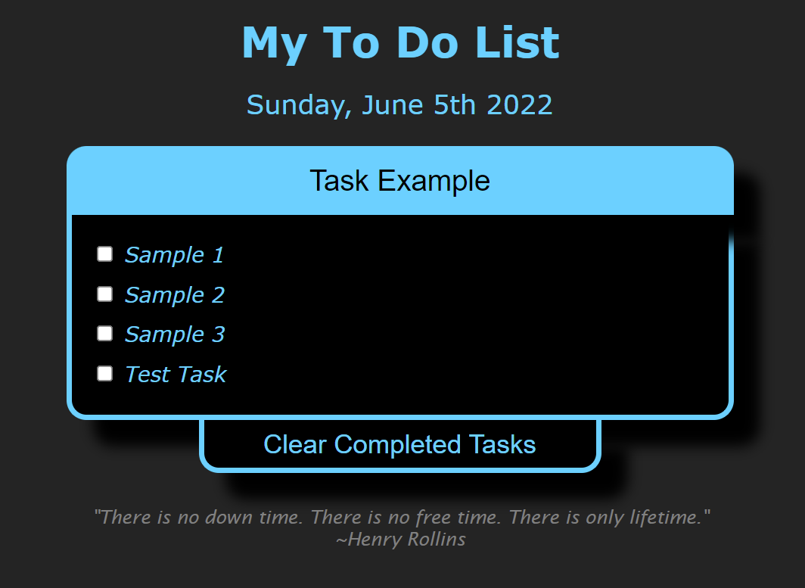

# To Do List

  ### Simple ToDo List in HTML/CSS/JavaScript
  

  
 ## Summary
 This individual project was a practical example of newly learned concepts of adding, modifying, and removing HTML elements
 based on user input. It solidifies experience in for loops, arrays, and basic HTML elements. This example project was designed
 with functionality in mind to demonstrate understanding and experience in JavaScript, and less emphasis was placed on design.
 
 ### Try it live [here](https://bcham16.github.io/ToDoList/)
 
 ## Author 
 Brandon Chamberlain - Apprentice Software Developer | [LinkedIn](https://www.linkedin.com/in/bchamberlain3618/) | 
 [Personal Website](https://www.thebrandonchamberlain.com)
